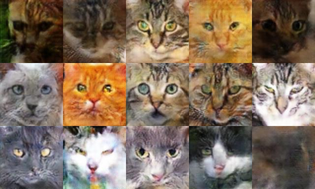

# DCGAN

## ①実施内容
　猫の顔画像をDCGANおよびLSGANで生成し、その精度を検証する。\
　64x64データでの実施はインターネットでもよく見かけるので、128x128のデータ生成を試みる。\
　参考HP：https://ajolicoeur.wordpress.com/cats/

## ②追加実施内容
　最適化アルゴリズムおよび活性化関数をそれぞれ、RAdam, Mishに変更した場合の、DCGANおよびLSGANにおける影響を検証する（注）。
 
  　RAdam :https://qiita.com/omiita/items/d24568a835da6911b01e　
  
 　　　　  (原論文)      https://arxiv.org/abs/1908.03265 
       
  　　　　 (論文筆者の公開しているRAdamコード)      https://github.com/LiyuanLucasLiu/RAdam 
       
  Mish  :https://atmarkit.itmedia.co.jp/ait/articles/2004/28/news017.html
  
  
  注：ざっと調べたが、どちらともGANの分野での有効性を調べているような資料はあまり見つからなかった。\
  　　はじめはMishと同様にReluの代替関数として考案されたTanhexp関数を実装して使おうと考えましたが\
　　なぜかいつも学習途中でCUDAのエラーが出て止まるので、Pytorchで公式実装済みのMish関数を使うことにしました…。

## データの説明
A．これまでに撮りためた我が家の猫の写真から顔写真をピックアップ。約800枚ほど。\
　　このデータで十分な学習を行うためには量が不足していると考えらえるため、以下のBのデータを追加してデータ量を増加させる。

B．KAGGLE（https://www.kaggle.com/spandan2/cats-faces-64x64-for-generative-models）
の猫画像サンプル。\
　 64x64のデータなので、128x128に拡大して使用する。\
　データサンプルは最大で30,000枚だが、生成結果へのAの影響をできるだけ大きくするためにそのうちから9,000枚程度を使用する(※)。\
※参考HPの結果から、学習データは合計9,000枚程度あれば充分に学習できると推定した。

## 結果
実施内容①の結果。DCGANで学習がおよそ収束したエポック数400回までの結果を比較した。\
なお学習率などのハイパーパラメータは参考HPでの値を参照し、結果を見ながら必要に応じて調整した。
